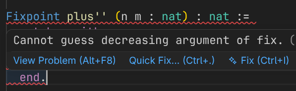

Software Foundations Volume 1: Logical Foundations 第一章 Basics 包含的题解<br>

#### Data and Functions
完成 nandb 定义并验证例子正确性
```coq
(** **** Exercise: 1 star, standard (nandb) *)
Definition nandb (b1:bool) (b2:bool) : bool :=
  match b1 with
    | true => (negb b2)
    | false => true
  end.

Example test_nandb1:               (nandb true false) = true.
Proof. simpl. reflexivity. Qed.
Example test_nandb2:               (nandb false false) = true.
Proof. simpl. reflexivity. Qed.
Example test_nandb3:               (nandb false true) = true.
Proof. simpl. reflexivity. Qed.
Example test_nandb4:               (nandb true true) = false.
Proof. simpl. reflexivity. Qed.
(** [] *)
```
同上，3 表示三个参数
```coq
(** **** Exercise: 1 star, standard (andb3) *)
Definition andb3 (b1:bool) (b2:bool) (b3:bool) : bool :=
  match b1 with
    | true => (andb b2 b3)
    | false => false
  end.

Example test_andb31:                 (andb3 true true true) = true.
Proof. simpl. reflexivity. Qed.
Example test_andb32:                 (andb3 false true true) = false.
Proof. simpl. reflexivity. Qed.
Example test_andb33:                 (andb3 true false true) = false.
Proof. simpl. reflexivity. Qed.
Example test_andb34:                 (andb3 true true false) = false.
Proof. simpl. reflexivity. Qed.
(** [] *)
```
完成一个 nat 上的阶乘，使用 Fixpoint 函数（也就是递归函数）
```coq
(** **** Exercise: 1 star, standard (factorial) *)

Fixpoint factorial (n:nat) : nat :=
  match n with
    | 0 => 1
    | S n' => mult n (factorial n')
  end.

Example test_factorial1:          (factorial 3) = 6.
Proof. simpl. reflexivity. Qed.
Example test_factorial2:          (factorial 5) = (mult 10 12).
Proof. simpl. reflexivity. Qed.
(** [] *)
```
一个比较函数，以及对应的 Notation，并不是 macro 的处理方式
```coq
(** **** Exercise: 1 star, standard (ltb) *)

Definition ltb (n m : nat) : bool :=
  match n <=? m with
    | true => 
      match n =? m with
        | true => false
        | false => true
      end
    | false => false
  end.

Notation "x <? y" := (ltb x y) (at level 70) : nat_scope.

Example test_ltb1:             (ltb 2 2) = false.
Proof. simpl. reflexivity. Qed.
Example test_ltb2:             (ltb 2 4) = true.
Proof. simpl. reflexivity. Qed.
Example test_ltb3:             (ltb 4 2) = false.
Proof. simpl. reflexivity. Qed.
(** [] *)
```

#### Proof by Simplification
无，所谓```simpl.```就是根据已有的 Definition 进行化简。

#### Proof by Rewriting
`rewrite.`的规则可以是命题给出中的假设，或者是之前证明过的`Theorem`
```coq
(** **** Exercise: 1 star, standard (plus_id_exercise) *)

Theorem plus_id_exercise : forall n m o : nat,
  n = m -> m = o -> n + m = m + o.
Proof.
  intros n m o. (* intros 务必按照匹配的顺序进行变量和谓词 *)
  intros H H'.
  rewrite -> H.
  rewrite -> H'.
  reflexivity. Qed.
(** [] *)
```
`->``<-`意思是改写的方向，如果不具体写出就是`->`
```coq
(** **** Exercise: 1 star, standard (mult_n_1) *)

Theorem mult_n_1 : forall p : nat,
  p * 1 = p.
Proof.
  intros p.
  rewrite <- mult_n_Sm.
  rewrite <- mult_n_O.
  reflexivity. 
Qed.
(** [] *)
```

#### Proof by Case Analysis
有时候命题的两边难以简化至其他term，无法直接使用`rewrite.`或者`simpl.`<br>
比如：
```coq
Theorem add_0_r : forall n : nat, 0 + n = n.
```
很容易证明，但是：
```coq
Theorem add_0_l : forall n : nat, n + 0 = n.
```
需要一些额外的技巧。
假设`plus`是这样定义的
```coq
Fixpoint plus (n : nat) (m : nat) : nat :=
  match n with
  | O => m
  | S n' => S (plus n' m)
  end.
```
`add_0_r`左边很容易简化到`n`，左右 term 相同就证明成功了。`add_0_l`则不知道具体走哪个match-branch。<br><br>
第一个双星题目，证明`andb_true_elim2`
```coq

(** **** Exercise: 2 stars, standard (andb_true_elim2)
    1. 可以对假设进行简化，[simpl in H.]
    2. 最终会需要破坏（destruct）两个 bool，最好在破坏第二个之前就简化一下 H
    3. 在某些不合理的 subgoal（比如已经枚举 c 是 false 了）下，你很可能发现 H 也不合理，这时使用 H rewrite，就能负负得正。
 *)

Theorem andb_true_elim2 : forall b c : bool,
  andb b c = true -> c = true.
Proof.
  intros b c.
  intros H.
  simpl in H.
  destruct b eqn:Eb. (* true | false *)
  - destruct c eqn:Ec.
    + reflexivity.
    + rewrite <- H. reflexivity.
  - destruct c eqn:Ec.
    + reflexivity.
    + rewrite <- H. reflexivity.
Qed.
(** [] *)
```
展示 `destruct` 的另一种用法（其实是另外几种）
```coq
(** **** Exercise: 1 star, standard (zero_nbeq_plus_1) *)
Theorem zero_nbeq_plus_1 : forall n : nat,
  0 =? (n + 1) = false.
Proof.
  intros []. (* 构造子用不上就可以不写 *)
  - simpl. reflexivity.
  - reflexivity.
Qed.
(** [] *)
```

#### More on Notation (Optional)
可选内容
```coq
Notation "x + y" := (plus x y)
                       (at level 50, left associativity)
                       : nat_scope.
Notation "x * y" := (mult x y)
                       (at level 40, left associativity)
                       : nat_scope.
```
- Notation 需要额外指示运算优先级和结合方式
- Notation 在不同的 scope 下代表的类型不同，可以使用```(x + y) % nat``` 辅助 Notation 的 elaboration
- notation mechanism 的能力是有限的

#### Fixpoints and Structural Recursion (Optional)
Rocq 需要确定一个```Fixpoint```函数是能终止的，<br>
更具体的来说，Rocq 要求对于所有的```Fixpoint```调用，其中某些实参需要```decreasing```<br>
但是这套```decreasing```有一些限制，它本身的定义就暗示了这一点，会拒绝一些实际上能终止的函数。
```coq
(** **** Exercise: 2 stars, standard, optional (decreasing) *)

Fixpoint plus'' (n m : nat) : nat := 
  match n with
    | 0 => m
    | S n' => S (plus'' m n')
  end.
```
效果如下


#### More Exercise
`->`就是`forall ,`的语法糖，只是对谓词这么描述不是很方便；```rewrite```方向不重要，两次一致即可<br>
```coq
(** **** Exercise: 1 star, standard (identity_fn_applied_twice) *)

Theorem identity_fn_applied_twice :
  forall (f : bool -> bool),
  (forall (x : bool), f x = x) ->
  forall (b : bool), f (f b) = b.
Proof.
  intros f Fx b.
  rewrite -> Fx.
  rewrite -> Fx.
  reflexivity.
Qed.
```
类似上面
```coq
(** **** Exercise: 1 star, standard (negation_fn_applied_twice) *)

Theorem negation_fn_applied_twice :
  forall (f : bool -> bool),
  (forall (x : bool), f x = negb x) ->
  forall (b : bool), f (f b) = b.
Proof.
  intros f Fx b.
  rewrite -> Fx.
  rewrite -> Fx.
  destruct b as [].
  - reflexivity.
  - reflexivity.
Qed.

(* Do not modify the following line: *)
Definition manual_grade_for_negation_fn_applied_twice : option (nat*string) := None.
(** (The last definition is used by the autograder.)

    [] *)
```
证明对任意b, c, 如果 b && c = b || c, 则 b = c
```coq
(** **** Exercise: 3 stars, standard, optional (andb_eq_orb) *)

Theorem andb_eq_orb :
  forall (b c : bool),
  (andb b c = orb b c) ->
  b = c.
Proof.
  intros [] c H.
  (* 需要注意的是 simpl in H 不能提出来，因为 bullet 内外 context 不同，化简结果也不同 *)
  - simpl in H. rewrite -> H. reflexivity.
  - simpl in H. rewrite -> H. reflexivity.
Qed.
```

#### Course Late Policies, Formalized
```coq
(** **** Exercise: 1 star, standard (letter_comparison) *)
Theorem letter_comparison_Eq :
  forall l, letter_comparison l l = Eq.
Proof.
  intros [].
  - reflexivity.
  - reflexivity.
  - reflexivity.
  - reflexivity.
  - reflexivity.
Qed.
```
```coq
(** **** Exercise: 2 stars, standard (grade_comparison) *)

Definition grade_comparison (g1 g2 : grade) : comparison :=
  match g1, g2 with
    | (Grade l1 m1), (Grade l2 m2) => 
      match letter_comparison l1 l2 with
      | Eq => modifier_comparison m1 m2
      | Gt => Gt
      | Lt => Lt
      end
  end.

(** The following "unit tests" of your [grade_comparison] function
    should pass once you have defined it correctly. *)

Example test_grade_comparison1 :
  (grade_comparison (Grade A Minus) (Grade B Plus)) = Gt.
Proof. simpl. reflexivity. Qed.

Example test_grade_comparison2 :
  (grade_comparison (Grade A Minus) (Grade A Plus)) = Lt.
Proof. simpl. reflexivity. Qed.

Example test_grade_comparison3 :
  (grade_comparison (Grade F Plus) (Grade F Plus)) = Eq.
Proof. simpl. reflexivity. Qed.

Example test_grade_comparison4 :
  (grade_comparison (Grade B Minus) (Grade C Plus)) = Gt.
Proof. simpl. reflexivity. Qed.
```
重写`Theorem lower_letter_lowers`，需要特殊处理`l = F`的情况
```coq
(** **** Exercise: 2 stars, standard (lower_letter_lowers) *)
Theorem lower_letter_lowers:
  forall (l : letter),
    letter_comparison F l = Lt ->
    letter_comparison (lower_letter l) l = Lt.
Proof.
  intros l H.
  destruct l;
  simpl in H;
  try rewrite <- H;
  simpl;
  reflexivity.
Qed.
```
填写并验证降级函数
```coq

(** **** Exercise: 2 stars, standard (lower_grade) *)
Definition lower_grade (g : grade) : grade :=
  match g with
    | Grade l m => 
      match m with
        | Plus => Grade l Natural
        | Natural => Grade l Minus
        | Minus => 
          match letter_comparison l F with
            | Eq => Grade F Minus
            | _ => Grade (lower_letter l) Plus
          end
      end
  end.
```
证明`lower_grade_lowers`，所有等级降一级之后都比原来少（即使是 F- ）
```coq
(** **** Exercise: 3 stars, standard (lower_grade_lowers)

    Hint: If you defined your [grade_comparison] function as suggested,
    you will only need to destruct a [letter] in one case.
    The case for [F] will probably benefit from [lower_grade_F_Minus].
  *)
Theorem lower_grade_lowers :
  forall (g : grade),
    grade_comparison (Grade F Minus) g = Lt ->
    grade_comparison (lower_grade g) g = Lt.
Proof.
  intros g H.
  destruct g as [l m] eqn:Eg.
  destruct l, m;
  simpl lower_grade;
  try rewrite -> H;
  reflexivity.
Qed.

(* 能用上 lower_grade_F_Minus 的写法 *)
Theorem lower_grade_lowers' :
  forall (g : grade),
    grade_comparison (Grade F Minus) g = Lt ->
    grade_comparison (lower_grade g) g = Lt.
Proof.
  intros g H.
  destruct g as [l m] eqn:Eg.
  rewrite <- lower_grade_F_Minus in H.
  destruct l, m;
  try rewrite -> H;
  simpl;
  reflexivity.
Qed.
```
这两个例子展示了直接展开`Definition`的效果，实际上就是`unfold`，区别于`simpl`，`unfold`是强制性的，而不是有简化空间才做。
```coq
(** **** Exercise: 2 stars, standard (no_penalty_for_mostly_on_time) *)
Theorem no_penalty_for_mostly_on_time :
  forall (late_days : nat) (g : grade),
    (late_days <? 9 = true) ->
    apply_late_policy late_days g = g.
Proof.
  intros late_days g H.
  rewrite -> apply_late_policy_unfold. (* 用 simpl. 不会有任何进展 *)
  rewrite -> H.
  reflexivity.
Qed.

(** **** Exercise: 2 stars, standard (graded_lowered_once) *)
Theorem grade_lowered_once :
  forall (late_days : nat) (g : grade),
    (late_days <? 9 = false) ->
    (late_days <? 17 = true) ->
    (apply_late_policy late_days g) = (lower_grade g).
Proof.
  intros last_days g H1 H2.
  rewrite -> apply_late_policy_unfold.
  rewrite -> H1.
  rewrite -> H2.
  simpl.
  reflexivity.
Qed.
```
二进制数字的自增、将二进制数转换到邱奇数
```coq
Inductive bin : Type :=
  | Z
  | B0 (n : bin)
  | B1 (n : bin).

(** Complete the definitions below of an increment function [incr]
    for binary numbers, and a function [bin_to_nat] to convert
    binary numbers to unary numbers. *)

Fixpoint incr (m:bin) : bin :=
  match m with
  | Z => B1 Z
  | B0 m' => B1 m'
  | B1 Z => B0 (B1 Z) (* B0 m *)
  | B1 m' => B0 (incr m')
  end.
Fixpoint bin_to_nat (m:bin) : nat :=
  match m with
  | Z => O
  | B0 m' => mult 2 (bin_to_nat m')
  | B1 m' => 1 + (mult 2 (bin_to_nat m'))
  end.
(** The following "unit tests" of your increment and binary-to-unary
    functions should pass after you have defined those functions correctly.
    Of course, unit tests don't fully demonstrate the correctness of
    your functions!  We'll return to that thought at the end of the
    next chapter. *)
```