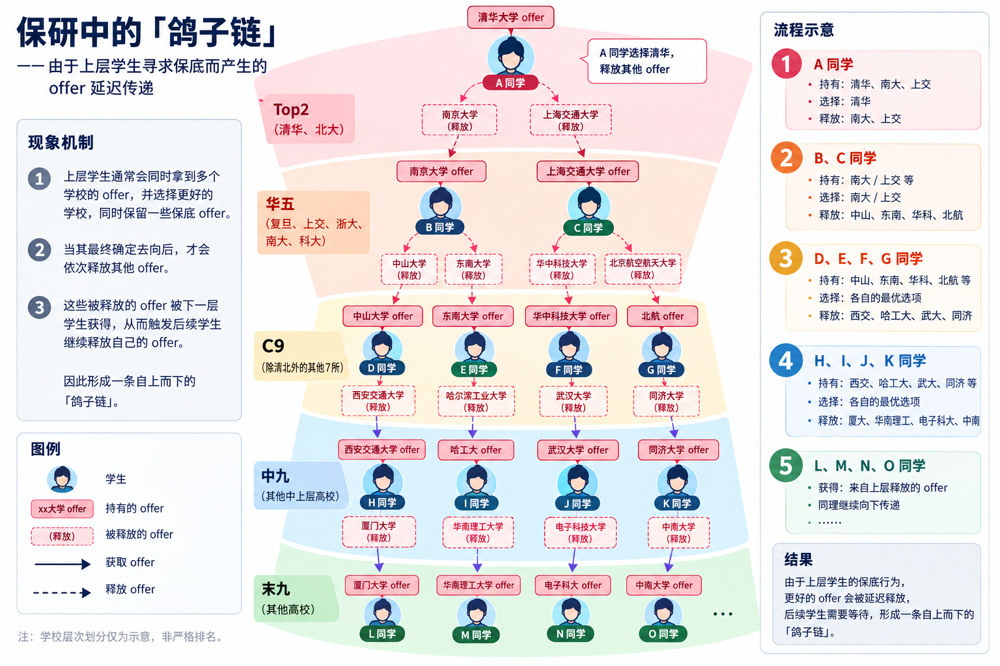

## 必懂黑话
|简称|含义|作用|
|---|---|---|
|bg|Background背景，一切保研时会考虑的因素：排名、竞赛、论文、科研等|决定双选的结果以及最终的去向|
|rk|rank排名，对于某些学校，这一项的具体数值实际上相当灵活|第一要素，缺什么都不能缺rk|
|pub/paper|就是论文，CCF B 以上的一作一般才会纳入考量|能发出一篇就是巨大优势，不过注意准备好相关的拷打|
|com|committee，强com指导师话语权少（没法捞），弱com则必须联系导师以获得名额|一般硕士强com，直博弱com|
|bar|入营的最低门槛|目前遇见的有：卡985，卡六级600分，卡B会一作，卡导师（弱com），以及最重要的卡rk|
|套瓷|提前联系学院导师，询问是否还有名额|直博必做，硕士有些院校需要|
|oq|over qualified，指你的水平远超了学院的水平，担心你鸽所以给你筛了|尼电cs今年疑似筛oq|
|默拒|常见于入营失败，不给发短信、不给发邮箱、系统永远显示在审核|恶心你|
|offer|能到目标院校就读|一般通过邮件或者电话通知，需要在某个截止日期之前确认|
|优营|目标院校认为你的表现不错，符合他们的招生要求|优营 != offer，有的学院会超发优营|
|wl|waiting list，候补队列，排名更靠前的人如果放弃了则按照名次递补|可能需要多等几天甚至几周|
|鸽穿|wl都递补完了，但是没入营的肯定不考虑|一般是学校bar、考核日期或者题目不合理导致的|考验大心脏|
|鸽子链|某些人有多份offer，当他release其中一个之后，空出的名额可能会带动其他人也release当前的offer|类似核裂变|

## 工具&资源
### 资讯相关
|名称|地址|评价|
|---|---|---|
|督战大奶牛の保研常见问题|https://docs.qq.com/sheet/DRU5pTWZCVnNQak9y?tab=BB08J2|⭐⭐⭐⭐⭐必看，what can I say|
|各种Ai|chatgpt、claude、deepseek等|⭐⭐⭐⭐⭐对话式的学习能快速提升你的应试水平|
|你的邮箱和短信|/|⭐⭐⭐⭐⭐不看没学上|
|小红书|/|⭐⭐⭐⭐推荐算法比较优秀，并且大量的导师会在上面发布招生信息|
|保研信息平台|https://www.baoyanxinxi.cn/2026jsjby/|⭐⭐⭐⭐主要是及时并且全，不知道明年还有没有人维护|
|绿群|https://github.com/CS-BAOYAN|⭐⭐⭐没啥用，要加只推荐加1群|
|各个学校官网|/|⭐捞完了，大部分学校内容搜索都写不明白|

### 机试相关
机试只推荐使用C/C++，不会的现在回去重学，部分极端的学校不让用STL。
|名称|评价|
|---|---|
|atcoder abc|⭐⭐⭐⭐英文题面，难度比较契合|
|acwing|⭐⭐⭐⭐拿来学不错，为了省钱的话可以去接手别人不再需要的号|
|leetcode|⭐⭐⭐一般，没有哪个学校的机试是写API的|
|洛谷|⭐⭐⭐一般，大部分机试题其实都够不到绿题的水平|
|cf|⭐⭐大部分题其实是脑筋急转弯？|
|pgcoder|⭐你这真题保真吗|

## 个人Bg
- 四川某985（并非某川唯9）软件工程学院23级
- 前5学期方向排名9/115（7.8%），最终学院推免排名（唯一排名）5/115
- 强竞赛经历，若干国奖
- 两段外校科研实习经历（nju & pku），一份长期一份短期，无产出
- 经历偏向硬件、系统软件、PL
- 不考虑直博、不考虑联培

## 夏令营&预推免
按时间顺序排列，具体到日期可能有所出入，com指的都是硕士的com
| 日期        | 院校     | 类型                                | bar（猜测）                                | 复试                                               | 考核结果                                     | 备注                                                                                                           | 最终结果                     |
|-------|-------------------------------------|------------------------------------------|-------------------------------------------------------------------|----------------------------------------------------|----------------------------------------------|----------------------------------------------------------------------------------------------------------------|------------------------------|
| 6月初       | 北大集电 | 导师面试，pku整体是弱com             | 让导师看的上你 | 需要提前准备ppt，压力面                             | 聊得非常投机，说我的方向非常符合他们做的事务  | 在同院的青椒下实习过3个月，面试是他帮我争取到的（十分感谢），读硕士给的是软微的名额（应该是联系比较晚了）            | release，主要是不想在北京呆着 |
| 7月初       | 尼电cs   | 预推，强com                          | 筛oq | /                                                                                                             | 未入营                                       | 据说9月还会再开一批                                                                                            | 后续未跟进                   |
| 7月8日      | 北航软院 | 无offer纯体验营 | 无，填系统就能进                          | 线上体验版机试，仅C，ACM赛制                                                            | /                                            | 2个小时打7题吗，很有操作了，不算考核所以不要Ai作弊                                                               | 后续未跟进，9月开了预推       |
| 7月28-29日  | 上交软院 | 夏令营，强com                        | 985前10%                                 | OI赛制，有大模拟，机试不算分；简历面+5分钟英语| 16/260+，方向第4（专硕），优营                   | 260多人只招38人，其中学硕/专硕/联培：11/9/18，分IPADS、ISCS、智软、交叉，每个方向给多少名额完全看他们今年缺多少本校生 | 专硕15w，直接release              |
| 7月28日     | 科软     | 夏令营，疑似弱com，入得少                    | 联系导师                                 | /                                                                                                                | 默拒，没套到所以没入                          | 和上交撞了，不过无论报录比还是待遇都好太多                                                                      | /                            |
| 8月23日左右 | 东南cs   | 预推免，强com                        | 卡9卡六级600卡B会一作，还默拒           | /                                                                                                                  | 未入营，祝鸽穿                                | **bar这么高你怎么敢的**                                                                                            | 据说可能再开第二批预推       |
| 9月初       | 复旦cs   | 预推免，强com                        | 可能是卡rk5，也有人说需要提前套           | /                                                                                                                 | 未入营                                       | /                                                                                                              | /                            |
| 9月5-6日    | 南大cs   | 预推免，强com                        | 大海营，但有一个线上初筛，考408选择题      | 两小时3道题，ACM赛制；专业问题+英语，据说有的很拷打但有的很轻松           | wl，多等两天等到了                            | 408/机试/面试：20%/30%/50%，408所有人一样烂，面试所有人一样好，只有机试能拉开差距                                  | /                            |
| 9月19日     | 浙大cs   | 预推免，强com                        | 只入了110多人，bar应该挺高的              | 无机试，来不及；简历面，自备ppt                                     | 入了没去，包括他们ai，软件据说也有不少人咕咕了 | 开太晚了主要是，浙计位置挺不错的                                                                                | /                            |

## 关于如何刷bg
入营一般是机筛，有用的bg一般是下面几种
- rank，最重要的
- 论文，CCF B甚至A会一作，发个C只会被嘲笑
- 专利，一般计算机类很少有
- 六级，有些学校会硬卡
复试的时候有用的以下几种
- 会打A，机试的优势也是优势
- 会talk，会吹牛逼也是优势
- 发表论文，会问论文细节：解决什么问题，idea怎么来的，个人做了什么贡献...
- 竞赛经历，技术性强的比赛（或者你负责技术性的工作），如果是ppt大赛就不是很有必要提起
- 实习经历，企业/高校实习，一定是科研性质的工作，前后端测试啥的别人都懒得拷打，可能会问：参与哪些项目开发，实现什么功能，复现过什么论文。如果是好奇宝宝可能问你有没有拿到实习单位的offer。
- 项目经历，一般是方向契合或者项目及其牛逼才会说，不然时间上可能轮不到。

## 鸽与被鸽的巴巴博弈
图解鸽子链，蹬GPT出来的，有一点瑕疵

鸽子链的本质是保研强手不断拿offer，是对保研弱手的剥削。会导致弱手原本更优的offer晚几周甚至几个月，非常恶心。更糟的是，这会迫使其他人去寻求保底offer，不管你主观上是否有犯罪意愿，也都实际上在加剧这个过程 
搞出鸽子链除了让某些**头部嘉豪**找到莫名其妙的爽感之外，没有任何用处，学生拿不到offer感到恐慌、院校鸽穿后只能再开或者乱招，被所有人抵制。 
而院校为了防范被鸽穿，也都各显神通：
- 上交：完全不信任外校生，你愿意来就捡捡交爷的剩饭吃吧
- 尼电：狂筛oq，想必211和双非一定对我感恩戴德吧
- 软微：你不来有的是人来（我那个release的offer被一个清华的顶上了）
- 科软：精挑细选 & 提前双选，搞搞弱com
- 南计 & 浙软：大海营，我才不怕鸽，一提到鸽我就高兴
- 东南，自杀行为，目前没看懂他们在干嘛